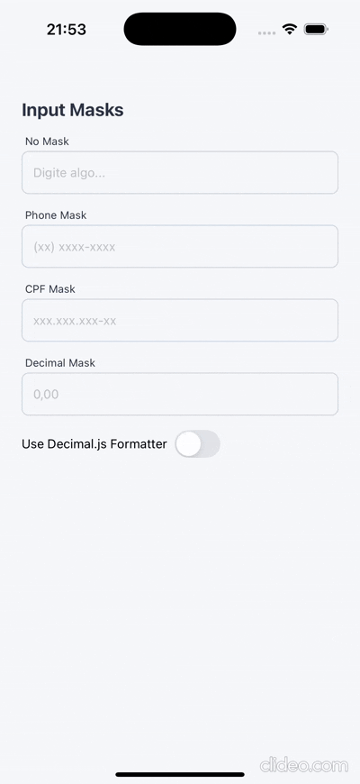

# React Native Input Masks 🎭

Welcome to **React Native Input Masks**, a personal project developed as a `Playground` for **exploring** and **implementing** text masks in React Native applications. This repository serves as a facilitator and showcase for creating formatted inputs in a practical and reusable way.

### Motivation

The need to handle specific formats for inputs such as phone numbers, CPF, or decimals is common in app development. This project was created to:

- Be a **personal playground** for testing and improving text masks.
- Serve as a facilitator for reusing masks in **React Native** applications.
- Explore solutions like **Decimal.js** for precise number manipulation.

## Features

The project currently supports the following masks:

- 📱 **Phone Mask**: Formats phone numbers according to specific national or international patterns.
- 📜 **CPF Mask**: Applies the standard Brazilian CPF formatting (`xxx.xxx.xxx-xx`) for input and data validation.
- 📊 **Decimal Mask**: Ensures precision when handling numbers by leveraging the **Decimal.js** library.

## Contributions

While this is a personal project, contributions are welcome! Feel free to fork the repository, open issues, or submit PRs.

Created with 🩶 by [Diogoizele](https://github.com/diogoizele)
